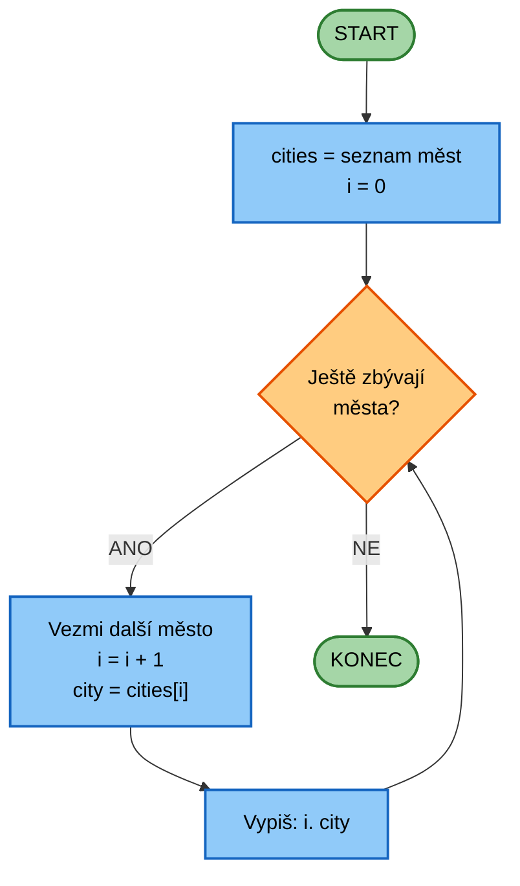
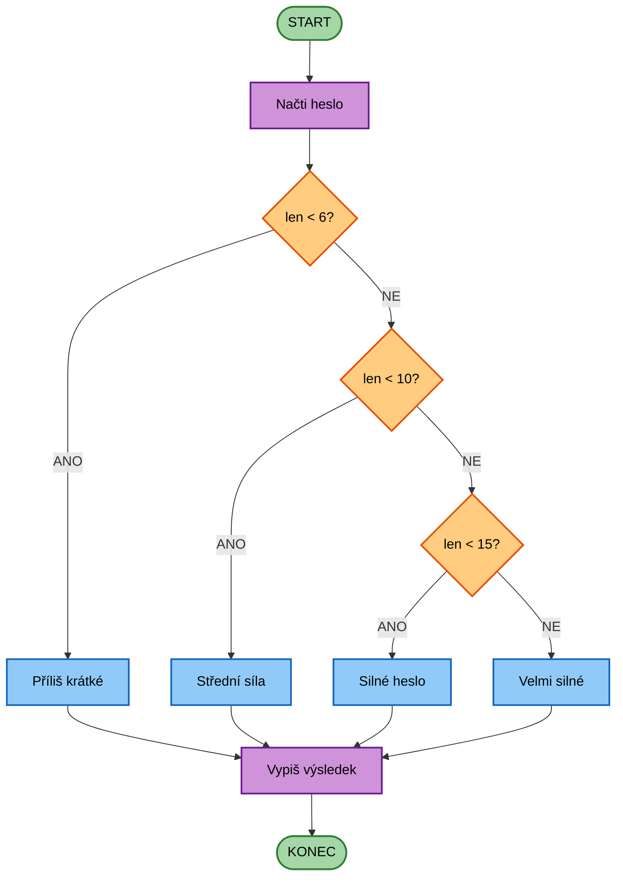

# CVIČENÍ 2: DATOVÉ TYPY TEXTOVÉ ŘETĚZCE

Algoritmizace a programování

## ÚVOD

Vítejte u druhého cvičení! V minulé lekci jsme se naučili základy – instalaci prostředí, první programy, práci s proměnnými a řízení toku programu. Možná si říkáte: "Dobře, umím vypsat text. Ale k čemu mi je práce s textem v medicíně?" 

Odpověď vás možná překvapí: **Téměř všechna data v medicíně začínají jako text nebo ho vyžadují ke zpracování.**

### Proč je práce s textem a datovými typy klíčová?

#### Text není jen "slova" – je to datová struktura

**Praktické využití v medicíně a bioinženýrství:**
- **Lékařské zprávy a databáze:** Jména pacientů, diagnózy (ICD-10 kódy), anamnézy
- **Bioinformatika:** DNA sekvence jsou řetězce (např. `"ACGTTAGC"`)
- **Elektronické zdravotní záznamy (EHR):** Zpracování strukturovaných i nestrukturovaných dat
- **Komunikace se zařízeními:** Příkazy pro diagnostické přístroje (často textové protokoly)
- **Analýza textů:** Natural Language Processing (NLP) pro automatickou analýzu lékařských zpráv

**Konkrétní příklady:**
```python
# Validace rodného čísla
birth_number = "9501152345"
is_valid = len(birth_number) == 10 and birth_number.isdigit()

# Normalizace jména pacienta
name = "  NOVÁK   Jan  "
clean_name = name.strip().title()  # "Novák Jan"

# Analýza DNA sekvence
dna = "ACGTTAGCTA"
gc_content = (dna.count("G") + dna.count("C")) / len(dna) * 100  # GC obsah v %

# Formátování výstupu z měřícího přístroje
temperature = 37.5
result = f"Teplota pacienta: {temperature:.1f} °C"
```

> **Klíčový poznatek:** Text nejsou jen "slova" – v programování je text **datová struktura**, se kterou musíme umět efektivně pracovat.

### Co jsou datové typy a proč na nich záleží?

Hodnota `120` v paměti může znamenat:
- **Systolický krevní tlak** (120 mmHg)
- **Tepová frekvence** (120 úderů/min)
- **Hladina glukózy** (120 mg/dL)
- **Číslo pacienta** (ID #120)
- **Text** (znak "x" v ASCII má kód 120)

Bez informace o **datovém typu** nevíme, jak data interpretovat!

Všechna data počítač ukládá jako **binární sekvence** (řady nul a jedniček), ale potřebuje vědět, **jak je interpretovat**.

**Datový typ** je **pravidlo**, které říká: "Tato sekvence bitů znamená *tohle*."

Počítač ukládá například sekvenci `01011001`. Co to může znamenat?

```python
# Jako celé číslo (int):
89

# Jako znak (str) v ASCII:
"Y"

# Jako barva pixelu (hodnota jasu 0–255):
Středně světlá šedá

# Jako True/False posloupnost bitů:
[False, True, False, True, True, False, False, True]
```

#### Binární soustava – jak počítač "myslí"

Zatímco my počítáme v desítkové soustavě (0–9), počítač používá pouze **0** a **1** (bity). 

**Proč?** Elektronické obvody rozpoznají jen dva stavy: proud teče / neteče, napětí vysoké / nízké.

Každý bit představuje mocninu dvojky:

| Pozice        | 7   | 6  | 5  | 4  | 3  | 2  | 1  | 0  |
|---------------|-----|----|----|----|----|----|----|----|
| **Bit**       | 0   | 1  | 0  | 1  | 1  | 0  | 0  | 1  |
| **Mocnina 2** | 2⁷  | 2⁶ | 2⁵ | 2⁴ | 2³ | 2² | 2¹ | 2⁰ |
| **Hodnota**   | 128 | 64 | 32 | 16 | 8  | 4  | 2  | 1  |

**Výpočet:** 0×128 + 1×64 + 0×32 + 1×16 + 1×8 + 0×4 + 0×2 + 1×1 = **64 + 16 + 8 + 1 = 89**

**8 bitů** = **1 byte** = dokáže uložit **256 různých hodnot** (0 až 255).

> **Vyzkoušej:**  
> ```python
> print(bin(89))  # Převod čísla na binární: '0b1011001'
> print(int('1011001', 2))  # Zpět na číslo: 89
> ```

> **Proč je to užitečné v medicíně?** CT a MR snímky používají 8-bitové (256 odstínů šedi) nebo 16-bitové (65 536 odstínů) reprezentace – větší rozsah = vyšší detaily v obrazu.

#### Rozsah a přesnost – proč záleží na velikosti?

Čím více bitů, tím větší rozsah nebo přesnost:

| Datový typ         | Počet bitů | Rozsah                          |
|--------------------|------------|---------------------------------|
| 8-bit int (byte)   | 8          | 0 až 255 (nebo -128 až 127)     |
| 16-bit int (short) | 16         | -32 768 až 32 767               |
| 32-bit int         | 32         | -2,1 miliard až 2,1 miliard     |
| 64-bit float       | 64         | ±10³⁰⁸ (s desetinnou přesností) |

**Proč to řešit?**  
Když zpracováváš miliony obrázků z CT skeneru, rozdíl mezi použitím 8-bitových a 32-bitových čísel může znamenat:
- **4× méně paměti** (1 GB vs. 4 GB)
- **Rychlejší výpočty** (méně dat = rychlejší zpracování)
- **Úspora nákladů** na cloudové úložiště

V datové vědě a AI je optimalizace klíčová – nemůžeš si dovolit plýtvat pamětí!

### Primitivní datové typy v Pythonu

Python je **dynamicky typovaný jazyk** – nemusíš předem říkat, jaký typ proměnná má. 

**Co to znamená?** Python "uhádne" typ podle hodnoty:
```python
x = 42        # Python vidí: "Aha, celé číslo → int"
x = 3.14      # Python vidí: "Aha, desetinné číslo → float"
x = "ahoj"    # Python vidí: "Aha, text → str"
```

To usnadňuje začátek, ale může vést k chybám, pokud nevíš, co děláš!

#### Základní typy

| Typ                 | Klíčové slovo | Rozsah           | Příklad použití v medicíně             |
|---------------------|---------------|------------------|----------------------------------------|
| **Celé číslo**      | `int`         | Prakticky ∞      | Počet pacientů, ID záznamu             |
| **Desetinné číslo** | `float`       | ±10³⁰⁸           | Teplota (37.5), tlak (120.5)           |
| **Logická hodnota** | `bool`        | `True` / `False` | Má pacient alergii? Je test pozitivní? |
| **Text**            | `str`         | ~1 milion znaků  | Jméno pacienta, diagnóza, DNA sekvence |

```python
# Python automaticky určí typ
age = 25           # int
price = 19.99      # float
is_student = True  # bool
name = "Alice"     # str

# Ověření typu
print(type(age))       # <class 'int'>
print(isinstance(price, float))  # True
```

#### Python vs jiné jazyky

**Staticky typované jazyky** (C, Java, C++) vyžadují deklaraci typu:
```c
int age = 25;        // Musíte říct, že "age" je int
float price = 19.99; // Musíte říct, že "price" je float
```

**Python** (dynamický):
```python
age = 25       # Automaticky int
age = "dvacet pět"  # Teď je to str - žádná chyba!
```

**Výhoda Pythonu:** Rychlejší psaní kódu, jednodušší start.  
**Nevýhoda:** Chyby typů se objeví až při běhu programu (ne při psaní).

**Příklad problému:**
```python
# Python ti to dovolí, ale výsledek může být nečekaný
age = "25"          # Text, ne číslo!
next_year = age + 1 # ❌ CHYBA: TypeError: can only concatenate str to str

# Musíš explicitně převést
age = int("25")     # Teď je to číslo
next_year = age + 1 # ✅ Funguje: 26
```

### Textové řetězce a Unicode

#### Proč Unicode?

V 80. letech minulého století každá země měla své vlastní kódování znaků:
- **ASCII** (USA) – 128 znaků (jen angličtina, bez háčků a čárek)
- **ISO-8859-2** (Česko) – 256 znaků (latinské jazyky)
- **Shift-JIS** (Japonsko) – tisíce znaků (hieroglyfy)

**Problém:** Když Čech poslal e-mail s "č" Američanovi, viděl nesmysl (`Ä`, `ř`...).

**Řešení:** **Unicode** (od 1991) – jeden standard pro **všechny jazyky světa**:
- Obsahuje 149 000+ znaků (latina, čínština, arabština, emoji...)
- Python ho používá nativně (od verze 3.0)
- Kódování **UTF-8**: každý znak zabírá 1–4 byty

```python
# Python umí všechny jazyky
text = "Hello 你好 مرحبا Привет 🐍"
print(len(text))  # 21 znaků (emoji = 1 znak!)

# Převod znaku na číslo a zpět
print(ord("ž"))   # 382 (pozice v Unicode)
print(chr(382))   # "ž"
```

**Praktické využití v medicíně a vědě:**

```python
# Speciální symboly v lékařských zprávách
symbols = "°C, µg/mL, ±2.5, α-helix, β-sheet, Δ (delta)"

# Matematické symboly
math = "∑ (suma), ∫ (integrál), √ (odmocnina), ∞ (nekonečno)"

# Chemické vzorce
chemistry = "H₂O, CO₂, Ca²⁺, Fe³⁺"

# DNA sekvence (IUPAC kódy)
dna = "ACGT (A=Adenin, C=Cytosin, G=Guanin, T=Thymin)"

print("Teplota pacienta: 37.5 °C")
print("Dávkování: 500 µg/mL")
print("Změna: ±2 %")
```

> **Vyzkoušej:**  
> ```python
> # Najdi Unicode kódy těchto symbolů
> print(ord("°"))  # Stupeň
> print(ord("µ"))  # Mikro
> print(ord("±"))  # Plus-mínus
> print(chr(8364)) # Jaký znak to je? (€)
> ```

#### Immutabilita – řetězce jsou nezměnitelné

**Důležité:** V Pythonu **nemůžete změnit řetězec**, jen vytvořit nový!

```python
name = "alice"
name.upper()       # Vrátí "ALICE", ale nezmění původní!
print(name)        # Stále "alice"

# Správně:
name = name.upper()  # Přiřadíme novou hodnotu
print(name)          # "ALICE"
```

**Analogie:** Řetězec je jako **tištěná kniha** – nemůžete přepsat slova, jen vytvořit novou verzi.

```python
# Zpracování záznamu pacienta
patient_id = "P12345"

# ❌ CHYBA - Řetězec se nezmění!
patient_id.replace("P", "ID")
print(patient_id)  # Stále "P12345"

# ✅ SPRÁVNĚ - Přiřadit nový řetězec
patient_id = patient_id.replace("P", "ID")
print(patient_id)  # "ID12345"

# Proto jsou metody bezpečné - nemění původní data
original_name = "JAN NOVÁK"
lowercase = original_name.lower()  # "jan novák"
titlecase = original_name.title()  # "Jan Novák"

# Originál zůstal nedotčený
print(original_name)  # Stále "JAN NOVÁK"
```

### ✅ Self-check: Rozumíš textovým řetězcům a datovým typům?

Než se vrhneme na praktické příklady, zkontroluj porozumění:

| Otázka                                   | Odpověď                                            |
|------------------------------------------|----------------------------------------------------|
| Co je binární sekvence `10110010`?       | Záleží na typu! Může být číslo 178, znak, barva... |
| Kolik hodnot dokáže uložit 1 byte?       | 256 (od 0 do 255, nebo -128 až 127)                |
| Je `"123"` číslo nebo text?              | Text (str), protože je v uvozovkách                |
| Co vrátí `"hello".upper()`?              | `"HELLO"` (nový řetězec)                           |
| Změní `text.upper()` proměnnou `text`?   | NE – řetězce jsou immutable                        |
| Proč Python používá Unicode místo ASCII? | Unicode umí všechny jazyky světa (150k znaků)      |

> **Tip:** Pokud některé odpovědi nejsou jasné, vrať se k příslušné sekci a přečti ji znovu. Tyto základy jsou klíčové pro celý kurz!

---

## CÍL 1: DATOVÉ TYPY A KONVERZE

Než se pustíme do práce s řetězci, musíme rozumět **datovým typům** a jak převádět mezi nimi.

### 1.1 Základní datové typy

| Typ     | Název                | Příklad               |
|---------|----------------------|-----------------------|
| `int`   | Celé číslo           | `42`, `-10`, `0`      |
| `float` | Desetinné číslo      | `3.14`, `-0.5`        |
| `str`   | Řetězec              | `"Hello"`, `'Python'` |
| `bool`  | Pravdivostní hodnota | `True`, `False`       |

### 1.2 Ověření typu

```python
value = "123"

print(type(value))              # <class 'str'>
print(isinstance(value, str))   # True
print(isinstance(value, int))   # False
```

### 1.3 Převod typů

**Text → Číslo:**
```python
age_text = "25"
age = int(age_text)
print(type(age_text))  # <class 'str'>
print(type(age))       # <class 'int'>
print(age + 5)  # 30

price_text = "19.99"
price = float(price_text)
print(type(price_text))  # <class 'str'>
print(type(price))       # <class 'float'>
print(price * 2)  # 39.98
```

**Číslo → Text:**
```python
score = 100
print(type(score))  # <class 'int'>
message = "Skóre: " + str(score)
print(type(message))  # <class 'str'>
print(message)  # "Skóre: 100"
```

## CÍL 2: ZÁKLADY PRÁCE S ŘETĚZCI

### 2.1 Načítání vstupu od uživatele - funkce input()

Než začneme pracovat s řetězci, musíme vědět, jak **získat data od uživatele**. K tomu slouží funkce `input()`.

**Základní syntaxe:**
```python
jmeno = input("Zadej své jméno: ")
print(f"Ahoj, {jmeno}!")
```

**Jak to funguje:**
1. Program se **zastaví** a čeká na vstup uživatele
2. Uživatel napíše text a stiskne **Enter**
3. Text se **uloží do proměnné** (vždy jako `str`!)
4. Program pokračuje dál

**Praktický příklad - sběr dat pacienta:**
```python
print("=== Registrace pacienta ===")
name = input("Jméno: ")
age = input("Věk: ")  # ⚠️ Vrací STRING, ne číslo!
allergies = input("Alergie (oddělené čárkou): ")

print(f"\nPacient: {name}")
print(f"Věk: {age} let")
print(f"Alergie: {allergies}")
```

**Výstup:**
```
=== Registrace pacienta ===
Jméno: Jan Novák
Věk: 35
Alergie: penicilín, latex

Pacient: Jan Novák
Věk: 35 let
Alergie: penicilín, latex
```

> **⚠️ KRITICKÉ:** `input()` **VŽDY vrací string**, i když uživatel zadá číslo!
> ```python
> age = input("Věk: ")  # Uživatel napíše: 25
> print(type(age))      # <class 'str'>
> # age + 5  # ❌ CHYBA! Nelze sčítat string a int
> 
> # Správně - převeď na int:
> age = int(input("Věk: "))
> print(age + 5)  # ✅ Funguje: 30
> ```

**Prázdný vstup:**
```python
response = input("Chceš pokračovat? (ano/ne): ")
if response == "":  # Uživatel jen stiskl Enter
    print("Nezadal jsi nic!")
```

---

**📝 ÚKOL: Převod měrných jednotek**

Vytvoř program, který:
1. Načte od uživatele teplotu ve Fahrenheitech (jako text)
2. Převede ji na číslo (`float`)
3. Vypočítá teplotu ve stupních Celsia podle vzorce: `celsius = (fahrenheit - 32) * 5/9`
4. Vypíše výsledek ve formátu: `"X °F je Y °C"`

💡 **Tip:** Nezapomeň převést vstup z `input()` na `float`!

> **Poznámka:** Pokud uživatel zadá neplatný vstup (např. text místo čísla), program spadne s chybou. Ošetření chyb (`try-except`) se naučíme později!
---

### 2.2 Vytváření řetězců

Řetězce vytvoříme pomocí uvozovek (`"`) nebo apostrofů (`'`). Oba způsoby jsou rovnocenné:

```python
message = "Hello, world!"
another_message = 'Hello, world!'

print(message)
print(another_message)
```

**Kdy použít jaké uvozovky?**
- Pokud text obsahuje apostrof, použij vnější uvozovky: `"Let's go!"`
- Pokud text obsahuje uvozovky, použij vnější apostrofy: `'He said "Hello"'`

**💻 Zkus:**
```python
# Vytvořte řetězec obsahující text: "Let's learn more about Python!"
text = "Let's learn more about Python!"
print(text)

# Co se stane, když použijeme apostrofy?
# text = 'Let's go'  # ❌ CHYBA - Python si myslí, že řetězec končí před Let
```

### 2.3 Délka řetězce

Funkce `len()` (length = délka) vrátí počet znaků v řetězci:

```python
text = "How are you?"
length = len(text)
print(f"Text má {length} znaků")  # 12
```

**Pozor:** Mezery se počítají! Prázdný řetězec `""` má délku 0.

**💻 Zkus:**
```python
print(len("Python"))    # 6
print(len("10"))        # 2 (text, ne číslo!)
print(len("3 + 1"))     # 5 (včetně mezer)
print(len(" "))         # 1 (mezera je znak)
print(len(""))          # 0 (prázdný řetězec)

# Praktický příklad - validace rodného čísla
birth_num = "9501152345"
if len(birth_num) == 10:
    print("Délka rodného čísla je správná")
else:
    print(f"Chyba: očekáváno 10 číslic, máme {len(birth_num)}")
```

---

**📝 ÚKOL: Kontrola délky hesla**

Vytvoř program, který:
1. Načte heslo od uživatele pomocí `input()`
2. Zjistí jeho délku pomocí `len()`
3. Vypíše: `"Tvoje heslo má X znaků"`
4. Pokud je heslo kratší než 8 znaků, vypíše: `"Heslo je příliš krátké!"`

---

### 2.4 Skládání řetězců

Řetězce spojíme operátorem `+`:

```python
greeting = "Dobrý den"
name = "Karle"
message = greeting + ", " + name + "!"
print(message)  # Dobrý den, Karle!
```

**Opakování řetězce** (`*`):

```python
print("Ha" * 5)  # HaHaHaHaHa
print("-" * 20)  # Čára z pomlček
```

**💻 Zkus:**
```python
# Načti jméno uživatele
user_name = input("Zadej své jméno: ")

# Vytvoř uvítací zprávu
message = "Vítej, " + user_name + "! Jsi skvělý programátor!"
print(message)

# Nebo pomocí f-stringu (moderní způsob):
print(f"Vítej, {user_name}! Jsi skvělý programátor!")
```

---

**📝 ÚKOL: Hlavička zprávy**

Vytvoř program, který:
1. Načte název nemocnice a oddělení
2. Vytvoří hlavičku složenou z opakujících se znaků `=` a textu:
   ```
   ==============================
   [Název nemocnice] - [Oddělení]
   ==============================
   ```

💡 **Tip:** Použij `"=" * 30` pro vytvoření čáry a `+` pro spojení textů.

---

### 2.5 F-stringy - moderní formátování textu

**F-stringy** (formatted string literals) jsou **nejlepší způsob**, jak v Pythonu skládat text s proměnnými. Jsou rychlé, čitelné a mocné.

#### Základní syntaxe

```python
name = "Jan"
age = 25

# Starý způsob:
message = "Ahoj, jmenuji se " + name + " a je mi " + str(age) + " let."

# F-string:
message = f"Ahoj, jmenuji se {name} a je mi {age} let."
print(message)  # "Ahoj, jmenuji se Jan a je mi 25 let."
```

**Proč f-stringy?**
- **Čitelnost:** Vidíš, co bude ve výstupu
- **Rychlost:** Rychlejší než `.format()` nebo `+`
- **Flexibilita:** Můžeš vkládat výrazy, ne jen proměnné

#### Výrazy uvnitř f-stringů

Do `{}` můžeš dát **jakýkoliv Python výraz**:

```python
a = 10
b = 5

print(f"Součet: {a + b}")        # "Součet: 15"
print(f"Rozdíl: {a - b}")        # "Rozdíl: 5"
print(f"Je a větší? {a > b}")    # "Je a větší? True"
print(f"Délka jména: {len('Python')}")  # "Délka jména: 6"
```

**Medicínský příklad:**
```python
bmi_weight = 75  # kg
bmi_height = 1.80  # m

# Výpočet přímo v f-stringu:
print(f"BMI: {bmi_weight / (bmi_height ** 2):.1f}")
# "BMI: 23.1"
```

#### Formátování čísel

Při práci s čísly často potřebujeme kontrolovat, kolik desetinných míst se zobrazí:

```python
pi = 3.141592653589793

print(f"Pi: {pi}")           # "Pi: 3.141592653589793"
print(f"Pi: {pi:.2f}")       # "Pi: 3.14" (2 desetinná místa)
print(f"Pi: {pi:.4f}")       # "Pi: 3.1416" (4 desetinná místa)
```

**Formát `{variable:.Xf}` znamená:**
- `variable` = proměnná, kterou chceš zobrazit
- `:.Xf` = zobraz s X desetinnými místy
  - `.2f` = 2 desetinná místa
  - `.1f` = 1 desetinné místo
  - `.0f` = žádné desetinné místo (zaokrouhlí)

**💻 Zkus - praktický úkol:**
```python
# Vytvoř program pro výpočet BMI s pěkným výstupem
name = input("Jméno: ")
weight = float(input("Váha (kg): "))
height = float(input("Výška (m): "))

bmi = weight / (height ** 2)

print(f"Pacient: {name.title()}")
print(f"Váha: {weight:.1f} kg")
print(f"Výška: {height:.2f} m")
print(f"BMI: {bmi:.2f}")

# Vyhodnocení
if bmi < 18.5:
    category = "podváha"
elif bmi < 25:
    category = "normální váha"
elif bmi < 30:
    category = "nadváha"
else:
    category = "obezita"

print(f"Kategorie: {category}")
```

---

**📝 ÚKOL: Výpočet krevního tlaku (MAP)**

Střední arteriální tlak (MAP) se počítá: `MAP = (systolic + 2 * diastolic) / 3`

Vytvoř program, který:
1. Načte systolický a diastolický tlak od uživatele
2. Vypočítá MAP
3. Vypíše výsledek s 1 desetinným místem: `"MAP: X.X mmHg"`

💡 **Tip:** Použij `{map:.1f}` pro formátování s 1 desetinným místem.

> **Shrnutí f-stringů:**
> - `{variable}` - prostě hodnota
> - `{variable:.2f}` - 2 desetinná místa
> - `{a + b}` - můžeš vkládat výrazy
> - F-stringy jsou **nejčitelnější a nejrychlejší** způsob formátování!

---

## CÍL 3: INDEXACE A PRŮCHOD ŘETĚZCEM

### 3.1 Indexování znaků

Každý znak má své **pořadí** (index), které začíná od **0**:

```python
word = "Python"
#       012345

first = word[0]   # "P"
third = word[2]   # "t"
last = word[5]    # "n"
```

**Záporné indexy** počítají odzadu:

```python
last = word[-1]   # "n"
second_last = word[-2]  # "o"
```

| Index   | 0  | 1  | 2  | 3  | 4  | 5  |
|---------|----|----|----|----|----|----|
| Znak    | P  | y  | t  | h  | o  | n  |
| Záporný | -6 | -5 | -4 | -3 | -2 | -1 |

**Praktický příklad:** Projití více indexů pomocí cyklu

```python
word = "Python"

# Vypíšeme znaky na pozicích 0, 2, 4
for i in [0, 2, 4]:
    print(f"Znak na indexu {i}: {word[i]}")

# Nebo můžeme projít všechny indexy
for i in range(len(word)):
    print(f"Index {i}: {word[i]}")
```

**💻 Zkus:**
```python
# Vytvoř proměnnou school = "Hogwarts" a vypiš 4. znak (index 3)
school = "Hogwarts"
print(school[3])  # "w"

# Vypiš poslední znak pomocí záporného indexu
print(school[-1])  # "s"

# Napiš cyklus, který projde indexy 1, 3, 5, 7 a vypíše znaky na těchto pozicích
for i in [1, 3, 5, 7]:
    print(f"Index {i}: {school[i]}")
```

### 3.2 Slicing (Řezání)

Pomocí `[start:end]` vyřízneme část řetězce:

```python
text = "Slytherin beats Gryffindor"
#       0123456789

team = text[0:9]   # "Slytherin"
team = text[:9]    # Totéž (začátek lze vynechat)
rest = text[9:]    # " beats Gryffindor" (konec lze vynechat)
```

**Pozor:** Konečný index (`end`) **není zahrnut**!

**Krok (step):**
```python
text = "0123456789"
print(text[::2])    # "02468" (každý druhý znak)
print(text[::-1])   # "9876543210" (otočení)
```

**Kompletní slicing s všemi parametry:**
```python
text = "0123456789"
print(text[1:8:2])   # "1357" (od indexu 1 do 8, každý druhý)
print(text[2:9:3])   # "258" (od indexu 2 do 9, každý třetí)
```

**💻 Zkus:**
```python
print("abcdefgh"[2:6])       # "cdef"
print("abcdefgh"[::3])        # "adg"
print("Python"[::-1])         # "nohtyP" (otočení)
print("Programming"[1:10:2])  # "rgamn" (od 1 do 10, každý druhý)

# Praktické použití - kontrola DNA sekvence
dna = "ACGTTAGCTA"
first_codon = dna[0:3]    # První kodon: "ACG"
print(f"První kodon: {first_codon}")

# Otočení řetězce (reverzní sekvence)
reversed_dna = dna[::-1]
print(f"Reverzní sekvence: {reversed_dna}")
```

---

**📝 ÚKOL: Extrakce data narození z rodného čísla**

České rodné číslo má formát: RRMMDDXXXX (např. "9501152345")
- První 2 znaky = rok (95)
- Znaky 2-4 = měsíc (01)
- Znaky 4-6 = den (15)

Vytvoř program, který:
1. Načte rodné číslo
2. Pomocí slicingu extrahuje rok, měsíc a den
3. Vypíše: `"Datum narození: DD.MM.RR"`

---

### 3.3 For cyklus přes znaky

Řetězec můžeme procházet znak po znaku pomocí `for`:

```python
word = "Python"

for character in word:
    print(character)
```

Výstup:
```
P
y
t
h
o
n
```

**💻 Zkus:**

**1) Vypiš každý druhý znak:**
```python
text = "Programming"
for i in range(0, len(text), 2):  # 0, 2, 4, 6, ...
    print(text[i])
# Výstup: P, o, r, m, i, g
```

**2) Spočítej počet malých písmen:**
```python
text = "Hello World"
count = 0

for char in text:
    if char.islower():
        count += 1

print(f"Počet malých písmen: {count}")  # 8
```

**3) Bonusový úkol - spočítej výskyty "a":**
```python
text = "banana"
count = 0

for char in text:
    if char == "a":
        count += 1

print(f"Písmeno 'a' se vyskytuje {count}×")  # 3

# Nebo jednoduše pomocí metody:
print(text.count("a"))  # 3
```

---

**📝 ÚKOL: Kontrola GC obsahu v DNA**

V bioinformatice je důležitý GC obsah (% bází G a C v sekvenci).

Vytvoř program, který:
1. Vytvoří proměnnou `dna` s nějakou sekvencí (např. `"ACGTTAGCTA"`)
2. Pomocí for cyklu projde všechny znaky
3. Spočítá, kolikrát se objevuje `"G"` nebo `"C"`
4. Vypíše: `"GC obsah: X znaků"`

---

## CÍL 4: METODY ŘETĚZCŮ

**Metoda** je funkce, která patří konkrétnímu objektu. Voláme ji pomocí **tečkové notace**: `objekt.metoda()`.

### 4.1 Změna velikosti písmen

```python
name = "severus snape"

print(name.upper())       # "SEVERUS SNAPE"
print(name.lower())       # "severus snape"
print(name.isupper())     # False
print(name.upper().isupper())  # True
```

**Důležité:** Metody **nevytváří novou hodnotu**, nezmění původní řetězec!

```python
name = "alice"
name.upper()      # Toto se ignoruje!
print(name)       # Stále "alice"

name = name.upper()  # Správně - přiřadíme výsledek
print(name)          # "ALICE"
```

### 4.2 Hledání a nahrazování

```python
text = "Python is amazing. Python is fun!"

# Hledání
position = text.find("amazing")  # Vrátí index: 10
position = text.find("Java")     # Vrátí -1 (nenalezeno)

# Nahrazení
new_text = text.replace("Python", "Programming")
print(new_text)  # "Programming is amazing. Programming is fun!"

# Počet výskytů
count = text.count("Python")  # 2
```

### 4.3 Rozdělení a spojení

```python
# Rozdělení na seznam
sentence = "Jablko,Hruška,Banán"
fruits = sentence.split(",")
print(fruits)  # ["Jablko", "Hruška", "Banán"]

# Spojení seznamu
words = ["Python", "je", "super"]
sentence = " ".join(words)
print(sentence)  # "Python je super"
```

**Praktický příklad: Zpracování CSV dat**

V medicíně často pracujeme s daty ve formátu CSV (Comma-Separated Values):

```python
# Jeden řádek z CSV souboru s vitálními funkcemi
data_line = "Jan Novák,35,120/80,72,36.6"

# Rozdělení na jednotlivé hodnoty
values = data_line.split(",")
print(values)
# ['Jan Novák', '35', '120/80', '72', '36.6']

# Přístup k jednotlivým hodnotám
name = values[0]
age = int(values[1])
blood_pressure = values[2]
heart_rate = int(values[3])
temperature = float(values[4])

print(f"Pacient: {name}, věk {age} let")
print(f"TK: {blood_pressure} mmHg, TF: {heart_rate} bpm")
print(f"Teplota: {temperature} °C")
```

**Zpětné spojení:**

```python
# Vytvoření nového záznamu
new_record = ["Marie Svobodová", "42", "115/75", "68", "36.8"]
csv_line = ",".join(new_record)
print(csv_line)
# "Marie Svobodová,42,115/75,68,36.8"
```

### 4.4 Ořezání mezer

```python
text = "   Hello   "
print(text.strip())   # "Hello"
print(text.lstrip())  # "Hello   "
print(text.rstrip())  # "   Hello"
```

**💻 Zkus:**
```python
email = "   USER@EXAMPLE.COM   "

# Očisti mezery a převeď na malá písmena
clean_email = email.strip().lower()
print(clean_email)  # "user@example.com"

# Praktický příklad - validace e-mailu
if "@" in clean_email and "." in clean_email:
    print("E-mail vypadá platně")
else:
    print("Neplatný formát e-mailu")
```

---

**📝 ÚKOL: Normální formát výstupu**

Vytvoř program, který:
1. Načte jméno pacienta (může obsahovat mezery na začátku/konci a být velkými písmeny)
2. Očistí mezery pomocí `strip()`
3. Převede na malá písmena pomocí `lower()`
4. Vypíše: `"Normální formát: [jméno]"`

---

### 4.5 For cyklus se seznamem slov

Když rozdělíme řetězec na seznam slov, můžeme je projít cyklem:

```python
teachers = "Snape,Dumbledore,Lupin,McGonagall"
teacher_list = teachers.split(",")

for teacher in teacher_list:
    print(f"Profesor {teacher} učí na Bradavicích.")
```

**Výstup:**
```
Profesor Snape učí na Bradavicích.
Profesor Dumbledore učí na Bradavicích.
Profesor Lupin učí na Bradavicích.
Profesor McGonagall učí na Bradavicích.
```

#### Funkce enumerate() - průchod s indexem

Často potřebuješ **číslo pořadí** při procházení seznamu. K tomu slouží `enumerate()`:

```python
cities = ["Praha", "Brno", "Ostrava", "Plzeň"]

# Bez enumerate - ruční čítání:
index = 0
for city in cities:
    print(f"{index + 1}. {city}")
    index += 1

# S enumerate - elegantnější:
for i, city in enumerate(cities, start=1):
    print(f"{i}. {city}")
```

**Výstup:**
```
1. Praha
2. Brno
3. Ostrava
4. Plzeň
```

**Jak enumerate() funguje:**
- `enumerate(seznam)` vrátí **dvojice**: (index, prvek)
- `start=1` říká: "začni počítat od 1" (výchozí je 0)
- `i, city` rozbalí dvojici na dvě proměnné

**Vývojový diagram for cyklu:**



**Medicínský příklad - list pacientů:**
```python
patients = "Jan Novák,Marie Svobodová,Petr Dvořák"
patient_list = patients.split(",")

print("=== SEZNAM PACIENTŮ ===")
for num, name in enumerate(patient_list, start=1):
    print(f"Pacient č. {num}: {name}")
```

**Výstup:**
```
=== SEZNAM PACIENTŮ ===
Pacient č. 1: Jan Novák
Pacient č. 2: Marie Svobodová
Pacient č. 3: Petr Dvořák
```

---

**📝 ÚKOL: Seznam diagnóz**

Vytvoř program, který:
1. Vytvoří řetězec s diagnózami oddělenými středníkem: `"Diabetes;Hypertenze;Astma;Migrena"`
2. Rozdělí ho na seznam pomocí `split(";")`
3. Pomocí `enumerate()` projde seznam a vypíše každou diagnózu s číslem:
   ```
   1. Diabetes
   2. Hypertenze
   3. Astma
   4. Migrena
   ```

---

### 4.6 Porovnávání řetězců

```python
password = "Python123"

if password == "Python123":
    print("Přístup povolen")
else:
    print("Špatné heslo")
```

**Pozor:** Záleží na velikosti písmen! `"Python" != "python"`

**Porovnání bez ohledu na velikost:**
```python
if password.lower() == "python123":
    print("Přístup povolen")
```

---

**📝 ÚKOL: Přihlášení do systému**

Vytvoř program, který:
1. Nastavil správné uživatelské jméno: `"admin"`
2. Načte uživatelské jméno od uživatele
3. Porovná ho se správným (bez ohledu na velikost písmen)
4. Pokud se shodují, vypíše: `"Přihlášení úspěšné!"`
5. Jinak vypíše: `"Neznámý uživatel!"`

---

### 4.7 Operátor `in`

Zjistí, zda řetězec obsahuje podřetězec:

```python
text = "I love vanilla ice cream"

if "vanilla" in text:
    print("Vanilka nalezena!")

if "chocolate" not in text:
    print("Čokoláda chybí!")
```

**Praktický příklad:** Kontrola obsahu

```python
comment = input("Napiš komentář: ")

if "spam" in comment.lower():
    print("Komentář obsahuje spam!")
elif "reklama" in comment.lower():
    print("Komentář obsahuje reklamu!")
elif "fake" in comment.lower():
    print("Komentář obsahuje nepravdivé informace!")
else:
    print("Komentář publikován")
```

**💻 Zkus:**
```python
# Načti větu od uživatele
sentence = input("Napiš větu: ")

# Zkontroluj, zda obsahuje "python" (bez ohledu na velikost)
if "python" in sentence.lower():
    print("Python je super!")
else:
    print("Zkus to znovu s Pythonem")
```
---

## CÍL 5: PODMÍNKY S ŘETĚZCI

### 5.1 Vnořené podmínky (if-elif-else)

Když máme více než 2 možnosti, použijeme `elif` (zkratka "else if"):

```python
password = input("Zadej heslo: ")

if len(password) < 6:
    result = "Příliš krátké (minimálně 6 znaků)"
elif len(password) < 10:
    result = "Střední síla"
elif len(password) < 15:
    result = "Silné heslo"
else:
    result = "Velmi silné heslo"

print(f"Hodnocení: {result}")
```

**Jak if-elif-else funguje:**
1. Python testuje podmínky **shora dolů**
2. Když najde **první pravdivou**, provede její blok a **skončí**
3. Pokud **žádná není pravdivá**, provede `else`

**Vývojový diagram:**



**Medicínský příklad - klasifikace BMI:**
```python
bmi = float(input("Zadej BMI: "))

if bmi < 18.5:
    category = "podváha"
    warning = "Doporučujeme zvýšit příjem kalorií"
elif bmi < 25:
    category = "normální váha"
    warning = "Vše v pořádku"
elif bmi < 30:
    category = "nadváha"
    warning = "Doporučujeme zvýšit pohybovou aktivitu"
else:
    category = "obezita"
    warning = "Konzultujte s lékařem"

print(f"Kategorie: {category}")
print(f"Doporučení: {warning}")
```

> **Pozor na pořadí!** Podmínky se testují shora dolů. Pokud dáš `elif bmi < 30` před `elif bmi < 25`, výsledek bude špatně!

---

## CÍL 6: ZÁKLADY DEBUGOVÁNÍ V PYCHARM

### 6.1 Co je debugování?

Debugování = **hledání a oprava chyb** v kódu. V minulém cvičení jsme používali `print()`, ale PyCharm má **mnohem mocnější nástroje**:

- **Breakpointy** – zastavení programu na konkrétním řádku
- **Krokování** – spuštění programu řádek po řádku
- **Inspekce proměnných** – zobrazení hodnot v reálném čase

### 6.2 Nastavení breakpointu

**Breakpoint** = červená tečka na okraji editoru, která říká: "Zastav program **PŘED** provedením tohoto řádku".

#### Jak nastavit:
1. Otevři soubor v PyCharmu
2. Klikni na **levý okraj** (na číslo řádku)
3. Objeví se **červená tečka** 🔴

**Příklad:**
```python
name = input("Zadej jméno: ")  # 🔴 Breakpoint zde
age = int(input("Zadej věk: "))
print(f"{name} je {age} let.")
```

### 6.3 Spuštění v debug módu

**Normální spuštění:** Zelené tlačítko ▶️ (Shift+F10)  
**Debug mód:** 🐞 Zelený brouček (Shift+F9)

**Co se stane:**
1. Program se **zastaví** na breakpointu
2. Spodní panel zobrazí **hodnoty proměnných**
3. Můžeš program **krokovat** (procházet řádek po řádku)

### 6.4 Ovládání debuggeru

| Klávesa      | Akce      | Popis                               |
|--------------|-----------|-------------------------------------|
| **Shift+F9** | Debug     | Spusť debuggování                   |
| **F8**       | Step Over | Proveď aktuální řádek               |
| **F9**       | Resume    | **Pokračuj** do dalšího breakpointu |
| **Ctrl+F2**  | Stop      | **Zastav** debugování               |

### 6.5 Praktický příklad: Debugování for cyklu

```python
text = "Python"
vowels = "aeiouAEIOU"
count = 0

for char in text:  # 🔴 Nastavte breakpoint ZDE
    if char in vowels:
        count += 1
    print(f"Kontroluji: {char}, počet samohlásek: {count}")

print(f"Celkem samohlásek: {count}")
```

**Postup debugování:**

1. **Nastav breakpoint** na řádek `for char in text:`
2. **Spusť debug** (🐞 nebo Shift+F9)
3. Program se zastaví před prvním průchodem cyklu
4. V panelu **Variables** uvidíš hodnoty proměnných:
   ```
   text = "Python"
   vowels = "aeiouAEIOU"
   count = 0
   ```
5. Stiskni **F8** (Step Over) → provede se `for char in text:`
6. Teď uvidíš `char = "P"`
7. Stiskni **F8** znovu a sleduj, jak se mění `count`
8. Stiskni **F9** (Resume) → program doběhne do konce

### 6.6 Časté debugovací situace

**Problém 1: Špatná hodnota/datový typ proměnné**
```python
temperature = input("Teplota: ")  # Uživatel zadal "37.5"
if temperature > 38:  # 🔴 Breakpoint
    print("Horečka!")
```
- Debugger ukáže: `temperature = "37.5"` (TEXT!)
- Chyba: Porovnáváš string s číslem
- Oprava: `temperature = float(input(...))`

**Problém 2: Index out of range**
```python
patients = ["Jan", "Marie", "Petr"]
print(patients[3])  # 🔴 Breakpoint
```
- Debugger ukáže: `len(patients) = 3`
- Indexy jsou 0, 1, 2 → index 3 neexistuje!

**💻 Praktický úkol - debugování:**

Vytvoř soubor `debug_practice.py` s tímto kódem a vyzkoušej debugování:

```python
text = "Python is great!"
vowel_count = 0
consonant_count = 0

for char in text:
    if char.isalpha():  # Pouze písmena
        if char.lower() in "aeiou":
            vowel_count += 1
        else:
            consonant_count += 1

print(f"Samohlásky: {vowel_count}")
print(f"Souhlásky: {consonant_count}")
```

**Postup:**
- Nastav breakpoint na řádek `for char in text:`
- Spusť debug mód (🐞 nebo Shift+F9)
- Krokuj (F8) prvními průchody
- Sleduj, jak se mění proměnné `char`, `vowel_count`, `consonant_count`

💡 **Tip:** Debugování **šetří čas**! Místo 10× print a opakovaného spouštění stačí JEDNOU projít debuggerem.

---

## ZÁVĚREČNÝ ÚKOL: ANALÝZA TEXTU

Vytvoř program `text_analyzer.py`, který:

1. **Načte větu** od uživatele
2. **Vypíše statistiku:**
   - Počet znaků (včetně mezer)
   - Počet slov
   - Počet samohlásek (a, e, i, o, u - bez ohledu na velikost)
3. **Vypíše větu pozpátku**
4. **Pokud věta obsahuje slovo "python"** (bez ohledu na velikost písmen), vypíše gratulaci

**Příklad výstupu:**
```
Zadej větu: Python je super jazyk!

=== STATISTIKA ===
Počet znaků: 22
Počet slov: 4
Počet samohlásek: 7

Věta pozpátku: !kyzaj repus ej nohtyP

Gratulujeme! Vaše věta obsahuje slovo 'python'! 🐍
```

💡 **Nápověda:**
- Samohlásky můžeš uložit jako: `vowels = "aeiouAEIOUáéíóúůÁÉÍÓÚŮ"`

---

## SHRNUTÍ

V tomto cvičení jsme se naučili:

**CÍL 1: Datové typy a konverze**
1. Základní datové typy: `int`, `float`, `str`, `bool`
2. Převádění mezi typy: `int()`, `float()`, `str()`
3. Ověřování typu: `type()`, `isinstance()`

**CÍL 2: Základy práce s řetězci**

4. Funkce `input()` - načítání vstupu od uživatele
5. Vytváření řetězců pomocí uvozovek `"` nebo `'`
6. Délka řetězce: `len()`
7. Skládání řetězců: `+` a opakování `*`
8. F-stringy pro moderní formátování: `f"Text {variable}"` a `{value:.2f}`

**CÍL 3: Indexace a průchod řetězcem**

9. Indexování znaků: `text[0]`, `text[-1]`
10. Slicing (řezání): `text[start:end:step]`, `text[::-1]`
11. For cyklus přes znaky: `for char in text:`

**CÍL 4: Metody řetězců**

12. Změna velikosti: `upper()`, `lower()`, `isupper()`
13. Hledání a nahrazování: `find()`, `replace()`, `count()`
14. Rozdělení a spojení: `split()`, `join()`
15. Ořezání mezer: `strip()`, `lstrip()`, `rstrip()`
16. Funkce `enumerate()` pro průchod sežnamem s indexy
17. Porovnávání řetězců: `==`, `in`, `not in`

**CÍL 5: Podmínky s řetězci**

18. Vnořené podmínky: `if-elif-else`

**CÍL 6: Debuggování**

19. Breakpointy v PyCharmu pro zastavení programu
20. Krokování debuggerem
21. Inspekce proměnných v debug módu

---

## 📝 SELF-CHECK: PROCVIČENÍ ZNALOSTÍ

### Část A: Datové typy a konverze

**1. Jaký je datový typ výsledku: `"5" + "3"`?**
- a) `int` s hodnotou 8
- b) `str` s hodnotou "53"
- c) `float` s hodnotou 8.0
- d) Chyba

<details>
<summary>✅ Správná odpověď</summary>
b) `str` s hodnotou "53" (concatenation řetězců)
</details>

**2. Co vrátí `int("3.14")`?**
- a) 3
- b) 3.14
- c) "3"
- d) ValueError (chyba)

<details>
<summary>✅ Správná odpověď</summary>
d) ValueError - int() neumí převést desetinné číslo jako string! Musí být: `int(float("3.14"))`
</details>

**3. Co je pravda o stringech v Pythonu?**
- a) Jsou mutable (lze měnit)
- b) Jsou immutable (nelze měnit)
- c) Obsahují pouze ASCII znaky
- d) Mají pevnou délku

<details>
<summary>✅ Správná odpověď</summary>
b) Jsou immutable - po vytvoření nelze změnit, lze jen vytvořit nový string
</details>

**4. Co vrátí `type("123")`?**
- a) `<class 'int'>`
- b) `<class 'str'>`
- c) `<class 'float'>`
- d) 123

<details>
<summary>✅ Správná odpověď</summary>
b) `<class 'str'>` - uvozovky znamená text, ne číslo!
</details>

**5. Jak převést text "37.5" na desetinné číslo?**
- a) `int("37.5")`
- b) `float("37.5")`
- c) `str(37.5)`
- d) `number("37.5")`

<details>
<summary>✅ Správná odpověď</summary>
b) `float("37.5")` - int() by vyhodilo chybu, protože "37.5" není celé číslo
</details>

### Část B: Indexování a slicing

**6. Co vypíše `"Python"[1]`?**
- a) "P"
- b) "y"
- c) "t"
- d) Chybu

<details>
<summary>✅ Správná odpověď</summary>
b) "y" (indexování od 0: P=0, y=1, t=2, ...)
</details>

**7. Co vrátí `"Hello"[-1]`?**
- a) "H"
- b) "o"
- c) "l"
- d) Chybu

<details>
<summary>✅ Správná odpověď</summary>
b) "o" (záporný index = od konce: -1=poslední, -2=předposlední, ...)
</details>

**8. Co vypíše `"Python"[1:4]`?**
- a) "yth"
- b) "ytho"
- c) "Pyt"
- d) "tho"

<details>
<summary>✅ Správná odpověď</summary>
a) "yth" (slice od indexu 1 DO indexu 4, ale BEZ něj: pozice 1, 2, 3)
</details>

**9. Jak získat string pozpátku?**
- a) `text.reverse()`
- b) `text[::-1]`
- c) `reverse(text)`
- d) `text[-1:]`

<details>
<summary>✅ Správná odpověď</summary>
b) `text[::-1]` (slice s krokem -1)
</details>

**10. Co vrátí `"Programming"[::2]`?**
- a) "Pormig"
- b) "Porming"
- c) "Pormn"
- d) "Pormi"

<details>
<summary>✅ Správná odpověď</summary>
a) "Pormig" (každý druhý znak: P-o-r-m-i-g)
</details>

### Část C: Metody stringů

**11. Co vrátí `"  Python  ".strip()`?**
- a) `"Python"`
- b) `"  Python  "`
- c) `"Python  "`
- d) `"  Python"`

<details>
<summary>✅ Správná odpověď</summary>
a) `"Python"` (odstraní mezery z obou stran)
</details>

**12. Co vypíše tento kód?**
```python
text = "python"
print(text.upper())
print(text)
```
- a) PYTHON\nPYTHON
- b) PYTHON\npython
- c) python\npython
- d) Chybu

<details>
<summary>✅ Správná odpověď</summary>
b) PYTHON\npython (`.upper()` vrací NOVÝ string, původní se NEMĚNÍ - immutability!)
</details>

**13. Co vrátí `"a,b,c".split(",")`?**
- a) `"abc"`
- b) `["a", "b", "c"]`
- c) `["a,b,c"]`
- d) `("a", "b", "c")`

<details>
<summary>✅ Správná odpověď</summary>
b) `["a", "b", "c"]` (seznam stringů)
</details>

**14. Co vrátí `"Hello World".find("o")`?**
- a) 1
- b) 4
- c) 7
- d) 2

<details>
<summary>✅ Správná odpověď</summary>
b) 4 (první výskyt "o" je na indexu 4: H-e-l-l-o)
</details>

**15. Co udělá `" ".join(["a", "b", "c"])`?**
- a) `"a b c"`
- b) `"abc"`
- c) `["a b c"]`
- d) `"a,b,c"`

<details>
<summary>✅ Správná odpověď</summary>
a) `"a b c"` (spojí prvky seznamu s mezerou mezi nimi)
</details>

**16. Co vrátí `"banana".count("a")`?**
- a) 1
- b) 2
- c) 3
- d) 4

<details>
<summary>✅ Správná odpověď</summary>
c) 3 (b-**a**-n-**a**-n-**a**)
</details>

### Část D: F-stringy a formátování

**17. Co vypíše `f"Hodnota: {3.14159:.2f}"`?**
- a) "Hodnota: 3.14159"
- b) "Hodnota: 3.14"
- c) "Hodnota: 3.1"
- d) "Hodnota: 3"

<details>
<summary>✅ Správná odpověď</summary>
b) "Hodnota: 3.14" (`.2f` = 2 desetinná místa)
</details>

**18. Co vypíše `f"{5 + 3}"`?**
- a) "5 + 3"
- b) "8"
- c) "53"
- d) Chybu

<details>
<summary>✅ Správná odpověď</summary>
b) "8" (f-string vyhodnotí výraz uvnitř `{}`)
</details>

### Část E: Praktické úkoly

**19. Co vypíše tento kód?**
```python
count = 0
for char in "Hello":
    if char in "aeiou":
        count += 1
print(count)
```

<details>
<summary>✅ Správná odpověď</summary>
`2` (samohlásky: e, o)
</details>

**20. Doplň kód pro kontrolu, zda věta obsahuje slovo "python" (case-insensitive):**
```python
sentence = "I love Python!"
if ___:  # DOPLŇTE
    print("Obsahuje python")
```

<details>
<summary>✅ Správná odpověď</summary>
```python
if "python" in sentence.lower():
    print("Obsahuje python")
```
</details>

**21. Napiš kód, který převede `"36.5"` (string) na číslo a přidá 1:**

<details>
<summary>✅ Správná odpověď</summary>
```python
temp_str = "36.5"
temp_num = float(temp_str)  # Převod
result = temp_num + 1  # 37.5
```
NEBO jednořádkově: `result = float("36.5") + 1`
</details>

**22. Co vypíše `len("Hello World")`?**
- a) 10
- b) 11
- c) 12
- d) 2

<details>
<summary>✅ Správná odpověď</summary>
b) 11 (mezera se počítá!)
</details>

### Část F: Debugování

**23. Co udělá breakpoint v PyCharmu?**
- a) Smaže řádek kódu
- b) Zastaví program na daném řádku během debug módu
- c) Označí chybu
- d) Spustí program rychleji

<details>
<summary>✅ Správná odpověď</summary>
b) Zastaví program na daném řádku během debug módu
</details>

**24. Co dělá klávesa F8 v debuggeru?**
- a) Spustí program normálně
- b) Step Over - provede aktuální řádek a posune se dál
- c) Ukončí debugování
- d) Nastaví breakpoint

<details>
<summary>✅ Správná odpověď</summary>
b) Step Over - provede aktuální řádek a posune se na další
</details>

**25. Co dělá klávesa F9 v debuggeru?**
- a) Step Over
- b) Resume - pokračuje do dalšího breakpointu
- c) Zastaví debugování
- d) Vrátí se o řádek zpět

<details>
<summary>✅ Správná odpověď</summary>
b) Resume - pokračuje do dalšího breakpointu (nebo do konce programu)
</details>

### Část G: Najdi chybu

**26. Co je špatně?**
```python
name = "Alice"
name[0] = "a"  # Změna na malé "a"
print(name)
```

<details>
<summary>✅ Správná odpověď</summary>
Stringy jsou IMMUTABLE! Nelze měnit jednotlivé znaky.  
Řešení: `name = "a" + name[1:]` nebo `name = name.replace("A", "a")`
</details>

**27. Co je špatně?**
```python
age = input("Věk: ")  # Uživatel zadá "25"
age_next_year = age + 1
```

<details>
<summary>✅ Správná odpověď</summary>
`input()` vrací STRING! Musí být: `age = int(input("Věk: "))`  
Jinak chyba: TypeError (nelze sčítat string a int)
</details>

**28. Co je špatně?**
```python
text = "python"
text.upper()
print(text)
```

<details>
<summary>✅ Správná odpověď</summary>
`.upper()` vrací NOVÝ string, ale nepřiřazujeme ho! Vypíše "python".  
Řešení: `text = text.upper()`
</details>

### Část H: CSV zpracování a seznamy

**29. Co vypíše tento kód?**
```python
data = "Jan,25,Praha"
parts = data.split(",")
print(parts[1])
```

<details>
<summary>✅ Správná odpověď</summary>
`"25"` (druhý prvek pole, ale jako STRING!)
</details>

**30. Co vrátí `enumerate(["a", "b", "c"], start=1)` při první iteraci?**
- a) (0, "a")
- b) (1, "a")
- c) (1, "b")
- d) "a"

<details>
<summary>✅ Správná odpověď</summary>
b) (1, "a") - `start=1` znamená, že indexování začíná od 1, ne od 0
</details>


## 🌟 BONUSOVÉ ÚKOLY

Tyto úkoly jsou pro ty, kteří chtějí procvičit nabyté znalosti nad rámec povinných úkolů.

### BONUS 1: Validátor rodného čísla

Napište program pro kontrolu českého rodného čísla a extrakci informací z něj.

**Zadání:**
1. Načtěte rodné číslo od uživatele pomocí `input()`
2. Zkontrolujte základní validitu:
   - Délka musí být přesně 10 znaků
   - Všechny znaky musí být číslice (použijte metodu `.isdigit()`)
3. Pokud je validní, extrahujte informace:
   - Rok narození: První 2 znaky (např. "95")
   - Měsíc: Znaky 2-4 (např. "01" pro muže, "51" pro ženy - u žen +50)
   - Den: Znaky 4-6 (např. "15")
4. Určete pohlaví:
   - Pokud je měsíc > 50, jedná se o ženu (odečtěte 50 od měsíce)
   - Jinak muž
5. Vypište výsledek:
   ```
   === ANALÝZA RODNÉHO ČÍSLA ===
   Rodné číslo: 9501152345
   Platnost: VALIDNÍ
   
   Datum narození: 15.01.1995
   Pohlaví: Muž
   
   Kontrolní součet: PLATNÝ
   ```

**Bonusová část:** Zkontrolujte dělitelnost 11:
- Převeďte rodné číslo na `int` a zkontrolujte: `int(birth_num) % 11 == 0`

---

### BONUS 2: Analýza a čištění lékařských záznamů

Napište program pro zpracování CSV dat z databáze pacientů.

**Zadání:**
1. Vytvořte string s CSV daty (každý řádek = jeden pacient):
   ```python
   data = """  JAN NOVÁK  ,  9501152345,  DIABETES  
     MARIE   SVOBODOVÁ,9652253456,HYPERTENZE
   PETR Dvořák,8803154567,  Astma  """
   ```
2. Rozdělte data na jednotlivé řádky pomocí `.split("\n")`
3. Pro každý řádek:
   - Rozdělte na části pomocí `.split(",")`
   - Očistěte každou část:
     - Odstraňte mezery (`.strip()`)
     - Převeďte jméno na title case (první písmeno každého slova velké)
     - Normalizujte diagnózu na malá písmena
   - Validujte rodné číslo:
     - Zkontrolujte délku (musí být 10)
     - Zkontrolujte, zda obsahuje pouze číslice
   - Vypište ve formátu:
     ```
     Pacient 1: Jan Novák
       RČ: 9501152345 [VALIDNÍ]
       Diagnóza: diabetes
     
     Pacient 2: Marie Svobodová
       RČ: 9652253456 [VALIDNÍ]
       Diagnóza: hypertenze
     
     Pacient 3: Petr Dvořák
       RČ: 8803154567 [VALIDNÍ]
       Diagnóza: astma
     ```
4. Na konci vypište statistiku:
   - Počet zpracovaných pacientů
   - Počet validních/nevalidních rodných čísel
   - Seznam všech unikátních diagnóz (bonus: použijte `set()`)


**Hint:** Pro rozdělení víceřádkového stringu:
```python
lines = data.split("\n")
for i, line in enumerate(lines, start=1):
    parts = line.split(",")
    name = parts[0].strip().title()
    # ... pokračuj zpracováním
```
